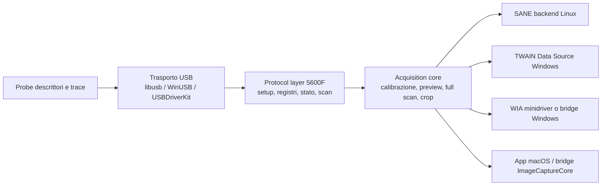

# Scrivere un driver per Canon CanoScan 5600F

## Sintesi esecutiva

Il Canon CanoScan 5600F è uno scanner piano A4 con unità per pellicole, sensore CCD a 6 linee, risoluzione ottica 4800×9600 dpi, 48 bit in ingresso, scansione pellicola, alimentatore AC integrato e collegamento Hi-Speed USB. Nelle fonti pubbliche consultate non compare alcuna connettività di rete: per questo modello il problema tecnico reale non è sviluppare un “driver di scansione” generico, ma implementare un trasporto USB vendor-specific e poi decidere come esporlo al sistema operativo o alle applicazioni. citeturn1view2turn15search3turn27search2

La strategia più solida, dato che l’OS target non è specificato, è **partire in user space** con un core di protocollo separato dal layer di integrazione. Su Linux ciò significa quasi sempre **studiare/estendere SANE genesys** o almeno riusarne il modello; su Windows conviene evitare un driver kernel custom finché non è indispensabile e iniziare con **WinUSB + servizio/applicazione user-space**, aggiungendo semmai in seguito un bridge TWAIN o un minidriver WIA; su macOS la via “driver” moderna passa da **USBDriverKit/DriverKit**, ma i costi di entitlement e packaging sono molto più alti rispetto a una prima implementazione di laboratorio. Questo orientamento coincide con il quadro dell’ecosistema descritto nel PDF allegato: i progetti scanner maturi tendono a **riusare stack esistenti**, non a partire da zero. citeturn27search2turn20search2turn20search19turn36search22turn36search4 fileciteturn1file0

Le fonti ufficiali trovate per il 5600F confermano **driver Canon TWAIN** storici per Windows e macOS, ma **non** documentano pubblicamente un SDK CanoScan dedicato. L’SDK ufficiale Canon reperibile oggi riguarda la linea imageFORMULA DR/CR, non i flatbed CanoScan. Sul lato open source, SANE ha aggiunto supporto al 5600F nella release 1.0.31 e le tabelle correnti lo riportano come **Complete**; tuttavia esistono issue recenti che mostrano come la compatibilità reale possa ancora essere sensibile a regressioni o modalità specifiche, ad esempio la scala di grigi. citeturn14search3turn14search9turn12search0turn12search3turn18search6turn27search2turn19view1

La conseguenza pratica è netta: se il tuo obiettivo è **far parlare il PC con lo scanner e scambiare dati**, la base migliore è una **implementazione user-space del protocollo USB** con acquisizione di trace dal driver Canon funzionante, ricostruzione delle sequenze di inizializzazione/calibrazione/scansione, e solo dopo eventuale incapsulamento in SANE, TWAIN, WIA o in un’app macOS. citeturn19view6turn19view7turn4search2turn38search0turn19view3

## Fonti primarie

Le fonti più utili da tenere aperte durante lo sviluppo sono queste:

| Fonte primaria | Perché serve |
|---|---|
| Supporto prodotto 5600F sul sito Canon Italia | Vista ufficiale per driver/software/manuali/compatibilità per OS. citeturn1view0turn13search0 |
| Specifiche ufficiali Canon Europe del 5600F | Hardware, risoluzione, profondità colore, interfaccia USB, OS storicamente supportati. citeturn1view2turn15search3 |
| Pagine download ufficiali Canon regionali del 5600F | Versioni visibili dei driver Windows/macOS e di MP Navigator EX. citeturn14search3turn14search9turn14search12turn14search4 |
| Canon Developer pages per DR Scanner SDK / imageFORMULA SDKs | Confermano che l’SDK pubblico Canon oggi è per imageFORMULA DR/CR, non per CanoScan. citeturn12search0turn12search3 |
| SANE backends e Supported Devices | Stato reale del supporto open source, USB ID, backend, regressioni note. citeturn27search2turn27search4turn18search6turn19view1 |
| Man page `sane-genesys` | Documenta il backend per chip Genesys GL646/GL841/GL843/GL847/GL124 e il modello operativo del driver. citeturn24search8turn30search1 |
| Microsoft WIA docs in italiano | Architettura WIA, pass-through TWAIN, INF, samples, tradeoff di integrazione nativa Windows. citeturn0search3turn19view3turn11search2turn11search10 |
| Documentazione WinUSB e signing | Necessaria se vuoi parlare al dispositivo da user space su Windows. citeturn20search0turn20search2turn20search19turn20search1turn20search12 |
| Apple ImageCaptureCore / USBDriverKit / entitlement USB | Necessarie se punti a macOS moderno. citeturn3search0turn11search8turn36search22turn36search2turn36search0turn36search4 |
| libusb, usbmon, PyUSB | Base per enumerazione, I/O USB, sniffing e prototipazione rapida. citeturn19view7turn3search4turn19view6turn22search0turn22search6 |
| Documento caricato dall’utente | Utile per il quadro architetturale generale di SANE/TWAIN/WIA/eSCL e per la scelta del livello giusto di integrazione. fileciteturn1file0 |

## Varianti di modello e differenze hardware

Per scrivere un driver conviene guardare non solo il 5600F ma anche i modelli vicini, perché mostrano quali aspetti sono **di famiglia** e quali sono invece **specifici del modello**. Nel caso Canon flatbed di quell’epoca, le differenze decisive sono: **CCD vs CIS**, **lampada riflessiva/film**, **alimentazione USB vs alimentatore dedicato**, e **famiglia di controller/backend usata da SANE**. citeturn15search0turn15search1turn15search2turn15search3turn24search8

| Modello | Differenze hardware rilevanti | USB ID / nota backend | Stato supporto driver oggi | Implicazione per il reverse engineering |
|---|---|---|---|---|
| CanoScan 4400F | CCD, lampada CCFL, 4800×9600, film, alimentatore AC, USB 2.0 | 04a9:2228; SANE lo associa a GL841 e lo segnala ancora come untested con warning di surriscaldamento | Supporto Canon storico legacy; lato SANE non è una baseline affidabile. citeturn15search0turn32search1turn30search0 | Utile solo come confronto di famiglia “vecchio CCD+film”; **non** lo sceglierei come modello gemello per partire. |
| CanoScan 5600F | CCD 6-linee, white LED per reflective + CCFL per film, 4800×9600, alimentatore AC integrato, USB Hi-Speed | 04a9:1906; nei vecchi backend tables è GL847-based | Driver Canon TWAIN pubblici; SANE attuale lo marca Complete, ma con issue storiche su alcune modalità. citeturn15search3turn14search3turn14search9turn27search2turn19view1turn29search2 | È il target diretto migliore. |
| CanoScan LiDE 700F | CIS, LED RGB, alimentazione via USB, film adapter, 4800×4800 reflective / 9600×9600 film | 04a9:1907; GL847-based, SANE Basic | Supporto Canon storico; SANE Basic. citeturn15search1turn32search3 | Buon modello di famiglia per capire la logica GL847, ma il percorso analogico/sensore è diverso dal 5600F. |
| CanoScan 9000F | CCD 12-linee, white LED, più veloce, 4800×4800 reflective / 9600×9600 film | 04a9:1908 | Supporto SANE Complete; prodotto più evoluto e film-oriented. citeturn15search2turn31search0 | Ottimo riferimento funzionale su flussi flatbed/film, ma non è detto che la mappa dei registri coincida con il 5600F. |

La lettura ingegneristica della tabella è questa. Se vuoi capire **il protocollo USB della famiglia**, il **LiDE 700F** è il parente più interessante perché condivide la matrice GL847 in SANE; se vuoi capire **il comportamento ottico e meccanico più vicino** al 5600F, allora conta di più il confronto con altri **CCD flatbed con film support**, specialmente 4400F e 9000F. Per una prima implementazione, però, eviterei di inseguire una “famiglia Canon” astratta: conviene catturare trace dal **tuo 5600F** e usare gli altri modelli solo come controllo di plausibilità. citeturn29search2turn32search3turn31search0turn32search1

## Driver ufficiali e protocolli

Le pagine ufficiali Canon trovate mostrano che il 5600F è stato distribuito con **ScanGear** e **MP Navigator EX**. Sul lato Windows, Canon pubblica ancora un **“CanoScan 5600F Scanner Driver Ver. 14.0.7a”**, esplicitamente descritto come **TWAIN-compliant scanner driver**; la storia aggiornamenti indica supporto aggiunto per Windows 10 e 8.1 e aggiornamento del catalog file firmato Microsoft. Come utility applicativa compare **MP Navigator EX Ver. 2.05**. citeturn14search3turn14search2

Sul lato macOS, le pagine ufficiali regionali Canon mostrano almeno due rami driver: **5600F Scanner Driver Ver. 14.11.4c** per OS X 10.5/10.6/10.7 e **5600F Scanner Driver Ver. 14.11.5a** per OS X 10.11 / macOS 10.12; per l’applicazione utente compaiono **MP Navigator EX 2.0.8** e **2.0.9** nelle pagine di supporto ufficiali. In altre parole, Canon ha mantenuto il 5600F per anni, ma in forma di **driver applicativo TWAIN + utility**, non come SDK pubblico per sviluppatori di terze parti. citeturn14search9turn14search12turn14search4

Per Linux non ho trovato, nelle fonti pubbliche Canon consultate, un pacchetto Linux ufficiale specifico per il 5600F comparabile ai download Windows/macOS. La strada documentata e oggi praticabile è quindi **SANE**, che nelle tabelle correnti di backends 1.4.0 riporta il **CanoScan 5600F (04a9:1906) come Complete**, con supporto per 300/600/1200/2400/4800 dpi in flatbed e transparency modes; il supporto è stato introdotto in upstream nella release 1.0.31. citeturn27search2turn18search6turn24search8

Sul fronte SDK, l’assenza è altrettanto importante del presente. La documentazione Canon Developers trovata pubblicamente parla di **DR Scanner SDK** e di altri SDK per la famiglia **imageFORMULA**, non di un SDK CanoScan flatbed. Quindi, salvo accesso privato non pubblico, devi assumere **assenza di SDK proprietario Canon per 5600F**. citeturn12search0turn12search3

Il quadro dei protocolli, per il 5600F, è questo:

| Protocollo / layer | Stato per 5600F | Lettura corretta |
|---|---|---|
| USB raw vendor-specific | **Sì** | È il livello reale da implementare se scrivi un driver tuo. Canon documenta solo il prodotto come USB Hi-Speed; le sequenze di controllo non sono pubbliche. citeturn15search3turn19view6turn19view7 |
| TWAIN | **Sì, confermato** | È il protocollo applicativo ufficialmente documentato da Canon per i driver pubblici trovati, sia lato Windows sia lato Mac. citeturn14search3turn14search9 |
| WIA | **Non confermato come driver Canon nativo** | Microsoft documenta WIA come architettura driver scanner di Windows e il pass-through TWAIN↔WIA come meccanismo di transizione, ma nelle fonti Canon consultate per 5600F il driver è descritto come TWAIN-compliant, non come minidriver WIA. citeturn0search3turn19view3turn11search10 |
| ICA / Image Capture | **Framework Apple disponibile; modulo 5600F non pubblicamente evidenziato** | Apple fornisce ImageCaptureCore/ImageKit per app scanner; non ho trovato, nelle fonti Canon pubbliche reperite, prova primaria di un modulo ICA dedicato al 5600F. citeturn3search0turn11search8 |
| SANE | **Sì, backend open source praticabile** | È il percorso Linux di riferimento. citeturn27search2turn24search8 |
| eSCL / AirScan / WSD | **No per 5600F** | Il 5600F è USB-only; i protocolli driverless di rete sono fuori scope per questo modello, anche se importanti per scanner Canon moderni. citeturn15search3 fileciteturn1file0 |

La conclusione pratica è che, per il **5600F**, non stai implementando “TWAIN” o “WIA” come protocollo hardware. Stai implementando **USB vendor-specific** e poi scegliendo un **adattatore di esposizione**: SANE backend, TWAIN Data Source, minidriver WIA, oppure app macOS basata su ImageCaptureCore. citeturn38search1turn11search4turn19view3turn3search0

## Trasporto, formato dati, comandi e sicurezza

Il dato certo è questo: il 5600F usa **Hi-Speed USB**, con identificazione **VID:PID 04a9:1906**, e non ci sono evidenze di trasporto di rete. Il dato **non** certo, nelle fonti primarie pubbliche consultate, è il dump completo dei descrittori `lsusb -v` del 5600F: non ho trovato un riferimento ufficiale o una cattura pubblica completa sufficiente per confermare tutti i campi `bcdUSB`, `bDeviceClass`, `bNumConfigurations`, `bInterfaceClass`, `bNumEndpoints`, `wMaxPacketSize`, e gli indirizzi endpoint esatti del tuo modello. citeturn15search3turn27search2turn21search7

| Campo / aspetto | Stato |
|---|---|
| `idVendor` / `idProduct` | **Confermato**: `0x04a9:0x1906`. citeturn27search2 |
| Velocità di bus | **Confermato**: Hi-Speed USB, quindi fino a 480 Mbit/s sul link host-device. citeturn15search3turn21search7 |
| Famiglia controller | **Fortemente probabile**: GL847-based nelle tabelle storiche SANE; utile come ipotesi di lavoro, non come verità ultima senza dump locale. citeturn29search2 |
| EP0 control | **Certo** in quanto endpoint standard USB; è il canale naturale per setup packet e vendor requests. citeturn19view6turn19view7 |
| Bulk IN / Bulk OUT | **Fortemente probabili** per il 5600F, perché sono il pattern tipico visto nelle trace SANE di scanner Genesys correlati; le trace GL84x mostrano lettura bulk dei dati immagine e bulk/register write. citeturn28search5turn28search1turn28search4 |
| Interrupt IN | **Possibile/probabile** come canale status nelle famiglie correlate; non confermato pubblicamente sul 5600F. citeturn28search5turn19view6 |
| Isochronous | **Nessuna evidenza pubblica** per il 5600F; non progettare attorno a esso finché una trace non lo dimostra. citeturn19view6turn28search5 |

In pratica, il modo corretto di trattare i descrittori è: **fatti i tuoi dump locali e considerali “source of truth”**. Su Linux puoi ottenere i descrittori completi con `lsusb -d 04a9:1906 -v`, oppure leggendo il file sysfs `.../descriptors`, che il kernel documenta come cache binaria dei descrittori in bus-endian. Questo è il materiale che ti serve per compilare davvero la matrice “device + interface + endpoint”. citeturn21search7turn19view6

Per i **formati immagine**, Canon conferma capacità di **48-bit input → 48/24-bit output** in colore e **48-bit input → 16/8-bit output** in grayscale, con modalità film dedicate. Ciò ti dice cosa il dispositivo è in grado di generare a livello funzionale, ma **non** documenta il formato raw on-wire. Dal comportamento del backend genesys e dalle issue aperte è ragionevole aspettarsi un flusso raster lineare non compresso letto in bulk dopo una fase di setup/calibrazione; però il dettaglio di **packing**, **endianness dei pixel**, **interleaving RGB vs planar**, e di eventuali header/preludi di frame va ricostruito da trace del 5600F o dal codice SANE specifico per il modello. citeturn15search3turn19view1turn27search2

Per i **comandi di controllo** e i **registri**, la situazione pubblica è parziale ma già utile. Le trace SANE di scanner Genesys correlati mostrano:

- uso di **vendor control OUT** con `bmRequestType = 0x40`; in una trace GL841 appare un `bRequest = 0x0c` durante l’inizializzazione; in altre discussioni di backend compare `bRequest = 0x04` nella logica di bulk/register write; citeturn28search5turn28search1  
- presenza di registri con semantica riconoscibile nella famiglia: `0x02` per controllo motore/auto-go-home, `0x03` per lamp/power, `0x20` per condizioni buffer, `0x41` come status misto, `0x51` per front-end addressing, `0xA6` per GPIO, oltre a vari registri di clock e slope; citeturn28search6turn24search2  
- una sequenza di lavoro che ha l’aspetto classico: **claim interface → script di registri → calibrazione → start scan → lettura bulk dei dati → end scan/home**. L’issue recente sul 5600F in scala di grigi mostra proprio che il motore può muoversi correttamente ma il flusso dati non arrivare, segno che il protocollo è una macchina a stati dove motore, front-end e buffer devono essere coerenti. citeturn19view1turn28search4

Quindi il modo rigoroso di esprimere il punto è questo: **esiste abbastanza materiale pubblico per inferire la forma del protocollo, ma non abbastanza per dichiarare una mappa registri completa e validata del 5600F senza trace locali**.

Per **firmware e bootloader**, non ho trovato nelle fonti Canon pubbliche un package firmware scaricabile specifico del 5600F, né una documentazione pubblica che indichi un upload host-side di firmware a ogni avvio. Canon espone una tab “Firmware” sulla pagina di supporto, ma le fonti consultate non mostrano un firmware pubblico effettivamente disponibile; in parallelo, il supporto SANE al 5600F è stato introdotto senza che le fonti consultate menzionassero un blob firmware esterno necessario. La lettura più prudente è: **assumi nessun firmware esterno finché una trace non dimostra il contrario**, e considera un’eventuale fase boot/upload come **unknown but testable**. citeturn27search0turn27search1turn18search6

Sul fronte **permessi e sicurezza**:

- su Linux, lo sviluppo raw USB richiede accesso al device tramite **udev/libusb**, e il kernel documenta sia l’**authorizing** dei dispositivi USB sia il fatto che i descrittori sono esposti in sysfs; inoltre documenta `power/autosuspend`, che durante il bring-up conviene spesso disabilitare per evitare timeout apparentemente “casuali”; citeturn21search1turn21search7  
- su Windows, se installi **WinUSB** come function driver puoi parlare al device da user space via `winusb.dll`, ma se scegli un driver kernel custom entri nel mondo **INF + signing + Hardware Dev Center + EV certificate**; citeturn20search0turn20search2turn20search1turn20search12  
- su macOS moderno, per dispositivi USB non class-compliant Apple indica **USBDriverKit** come strada ufficiale per i driver e richiede entitlement specifici; se distribuisci un’app sandboxed che deve accedere a USB da user space, esiste anche l’entitlement `com.apple.security.device.usb`. citeturn36search22turn36search2turn36search4turn36search0turn36search3

## Piano di sviluppo

La scelta architetturale consigliata è questa: **un core di protocollo unico**, con trasporto USB separato dalla logica scanner e dagli adapter OS.



Questa separazione è la differenza tra un proof-of-concept che vive e uno che muore al primo cambio di OS. SANE, TWAIN e WIA sono tutti stack che beneficiano di un **device core** già pulito. citeturn24search8turn38search0turn11search4turn19view3

La sequenza di sviluppo che consiglierei è la seguente.

1. **Fissa un OS di riferimento**. Poiché non hai specificato il target, scegli inizialmente **Linux** oppure **Windows**. Linux è il migliore per osservabilità e rapidità di iterazione; Windows è il migliore se vuoi catturare il comportamento del driver Canon ufficiale. citeturn19view6turn4search2turn27search2

2. **Raccogli i descrittori completi e le trace “golden”**. Devi registrare almeno: apertura dispositivo, preview 75/150/300 dpi, scan 300 dpi RGB 8 bit, scan 300 dpi gray 8 bit, scan film, fine sessione. Su Linux usa `usbmon`; su Windows usa `USBPcap` con Wireshark. citeturn19view6turn4search2

3. **Implementa una libreria minimale user-space** che faccia solo: enumerate → open → claim interface → get/set status → reset/clear halt → dump traffico. Prima di inseguire le immagini, devi saper riprodurre la fase di init. Per questa parte usa **libusb** in C/C++ e, se vuoi iterare più in fretta, **PyUSB** in parallelo. citeturn19view7turn22search0turn22search6

4. **Ricostruisci la macchina a stati**. Cambia **una variabile alla volta** nelle trace: dpi, colore/gray, flatbed/film, preview/full. Se un singolo parametro cambia sempre gli stessi byte o gli stessi registri, hai trovato un mapping utile. Le trace SANE di famiglia mostrano che lampada, buffer, motore e front-end sono distinti: sfrutta quella struttura. citeturn28search6turn19view1

5. **Porta a casa un primo target stretto**: `flatbed + color + 300 dpi + 8 bit`. È la milestone giusta per chiudere il ciclo init → start → bulk read → stop → file immagine. Tutto il resto viene dopo. citeturn15search3turn27search2

6. **Aggiungi calibrazione, preview e robustezza I/O**. Il backend genesys mostra che la parte difficile non è sempre avviare il motore, ma far sì che il buffer immagine si riempia e venga letto con la giusta lunghezza. Devi gestire short reads, timeout parziali, stall, autosuspend e condizioni di “device busy”. citeturn19view1turn19view7turn21search7

7. **Solo dopo scegli il wrapper di integrazione**.  
   - Linux: backend SANE o utility standalone.  
   - Windows: WinUSB + app/servizio, poi eventualmente **TWAIN DS**; WIA nativo solo se ti serve integrazione sistema profonda.  
   - macOS: app/headless se puoi riusare il driver esistente; **USBDriverKit** solo se vuoi davvero sostituire il path driver. citeturn20search19turn38search0turn19view3turn36search22

La scelta **user-space vs kernel-space** si riassume così:

| Scelta | Quando ha senso | Perché la consiglierei o la eviterei |
|---|---|---|
| User-space puro con libusb / PyUSB | Bring-up, reverse engineering, tool CLI, prototipo | **Scelta iniziale migliore**: niente signing kernel, debug rapido, portabilità alta. citeturn19view7turn22search0 |
| Backend SANE | Target Linux reale | Riusa modello frontend/backend e riduce il lavoro applicativo. citeturn24search8turn27search2 |
| WinUSB + app/servizio | Target Windows pratico senza WIA nativo | Molto meno complesso di un driver kernel custom. citeturn20search2turn20search19 |
| TWAIN Data Source | Se ti serve interoperare con app imaging classiche su Windows | Buono come adapter sopra un core già funzionante; i sample ufficiali sono utili. citeturn11search1turn38search0turn38search2 |
| WIA minidriver | Se vuoi integrazione nativa Windows Scanner/Imaging | Più costo, più INF/signing/WDK; non partirei da qui. citeturn0search3turn19view3turn11search7 |
| USBDriverKit | Se vuoi un vero path driver su macOS moderno | Strada ufficiale, ma con entitlements e costi di packaging elevati. citeturn36search22turn36search2turn36search4 |

Di seguito trovi due skeleton essenziali. Sono volutamente **incompleti sui valori vendor-specific**: i placeholder vanno riempiti dai tuoi dump e dalle trace.

Il primo esempio mostra **enumerazione USB, claim interfaccia, transfer di controllo e bulk read in C con libusb**. La forma delle API e dei campi setup è quella documentata da libusb; gli identificativi specifici del 5600F vanno derivati dalle trace. citeturn19view7

```c
// build: cc -Wall -O2 canoscan_probe.c -lusb-1.0 -o canoscan_probe
#include <libusb-1.0/libusb.h>
#include <stdio.h>
#include <stdint.h>
#include <string.h>

#define CANON_VID 0x04a9
#define CS5600F_PID 0x1906

// Da ricavare con lsusb -v / usbmon / USBPcap:
#define IFACE_NUM        0          // placeholder
#define ALT_SETTING      0          // placeholder
#define EP_BULK_IN       0x81       // placeholder: confermare dai descrittori reali
#define EP_BULK_OUT      0x02       // placeholder
#define REQ_WRITE_REG    0x00       // placeholder: verificare da trace
#define REQ_READ_REG     0x00       // placeholder
#define REG_STATUS       0x00       // placeholder
#define REG_START_SCAN   0x00       // placeholder

static int dump_endpoints(libusb_device *dev) {
    struct libusb_config_descriptor *cfg = NULL;
    if (libusb_get_active_config_descriptor(dev, &cfg) != 0) return -1;
    for (int i = 0; i < cfg->bNumInterfaces; ++i) {
        const struct libusb_interface *itf = &cfg->interface[i];
        for (int a = 0; a < itf->num_altsetting; ++a) {
            const struct libusb_interface_descriptor *alt = &itf->altsetting[a];
            printf("Interface %d alt %d class=0x%02x subclass=0x%02x proto=0x%02x endpoints=%d\n",
                   alt->bInterfaceNumber, alt->bAlternateSetting,
                   alt->bInterfaceClass, alt->bInterfaceSubClass,
                   alt->bInterfaceProtocol, alt->bNumEndpoints);
            for (int e = 0; e < alt->bNumEndpoints; ++e) {
                const struct libusb_endpoint_descriptor *ep = &alt->endpoint[e];
                printf("  EP 0x%02x attr=0x%02x maxpkt=%u interval=%u\n",
                       ep->bEndpointAddress, ep->bmAttributes,
                       ep->wMaxPacketSize, ep->bInterval);
            }
        }
    }
    libusb_free_config_descriptor(cfg);
    return 0;
}

static int write_reg(libusb_device_handle *h, uint16_t reg, uint8_t value) {
    unsigned char data[1] = { value };
    // bmRequestType=0x40 => vendor, host-to-device.
    // bRequest/wValue/wIndex dipendono dal protocollo reale.
    return libusb_control_transfer(h, 0x40, REQ_WRITE_REG, reg, 0, data, sizeof(data), 1000);
}

static int read_reg(libusb_device_handle *h, uint16_t reg, uint8_t *value) {
    unsigned char data[1] = { 0 };
    // Tipicamente vendor IN = 0xC0, ma va confermato da trace.
    int rc = libusb_control_transfer(h, 0xC0, REQ_READ_REG, reg, 0, data, sizeof(data), 1000);
    if (rc == 1) *value = data[0];
    return rc;
}

int main(void) {
    libusb_context *ctx = NULL;
    libusb_device_handle *h = NULL;
    libusb_device **list = NULL;

    if (libusb_init(&ctx) != 0) return 1;
    ssize_t n = libusb_get_device_list(ctx, &list);
    for (ssize_t i = 0; i < n; ++i) {
        struct libusb_device_descriptor dd;
        if (libusb_get_device_descriptor(list[i], &dd) == 0 &&
            dd.idVendor == CANON_VID && dd.idProduct == CS5600F_PID) {
            printf("Trovato 5600F: bus=%u addr=%u bcdUSB=0x%04x class=0x%02x configs=%u\n",
                   libusb_get_bus_number(list[i]),
                   libusb_get_device_address(list[i]),
                   dd.bcdUSB, dd.bDeviceClass, dd.bNumConfigurations);
            dump_endpoints(list[i]);
            if (libusb_open(list[i], &h) == 0) break;
        }
    }

    if (!h) {
        fprintf(stderr, "Scanner non trovato.\n");
        libusb_free_device_list(list, 1);
        libusb_exit(ctx);
        return 2;
    }

#ifdef __linux__
    // Se un backend di sistema ha già preso il device, questo può essere necessario.
    if (libusb_kernel_driver_active(h, IFACE_NUM) == 1) {
        libusb_detach_kernel_driver(h, IFACE_NUM);
    }
#endif

    if (libusb_claim_interface(h, IFACE_NUM) != 0) {
        fprintf(stderr, "claim_interface fallita\n");
        goto out;
    }

    uint8_t status = 0;
    if (read_reg(h, REG_STATUS, &status) > 0) {
        printf("status=0x%02x\n", status);
    }

    // Avvio scansione: sostituire con la vera sequenza ricavata da trace.
    (void)write_reg(h, REG_START_SCAN, 0x01);

    unsigned char buf[64 * 1024];
    int transferred = 0;
    int rc = libusb_bulk_transfer(h, EP_BULK_IN, buf, sizeof(buf), &transferred, 5000);
    printf("bulk rc=%d transferred=%d\n", rc, transferred);

    libusb_release_interface(h, IFACE_NUM);

out:
    libusb_close(h);
    libusb_free_device_list(list, 1);
    libusb_exit(ctx);
    return 0;
}
```

Il secondo esempio fa la stessa cosa in **Python con PyUSB**, utile per iterare rapidamente e annotare le trace. PyUSB appoggia il backend di sistema, tipicamente libusb. citeturn22search0turn22search6

```python
# pip install pyusb
import usb.core
import usb.util

VID = 0x04A9
PID = 0x1906

# Da confermare con trace/descrittori:
IFACE_NUM     = 0
EP_BULK_IN    = 0x81
REQ_WRITE_REG = 0x00   # placeholder
REQ_READ_REG  = 0x00   # placeholder
REG_STATUS    = 0x00   # placeholder

dev = usb.core.find(idVendor=VID, idProduct=PID)
if dev is None:
    raise RuntimeError("5600F non trovato")

# Se il device è già configurato dal driver di sistema, può essere necessario adattare questa parte.
dev.set_configuration()
cfg = dev.get_active_configuration()

for intf in cfg:
    print(f"Interface {intf.bInterfaceNumber} class=0x{intf.bInterfaceClass:02x}")
    for ep in intf:
        print(f"  EP 0x{ep.bEndpointAddress:02x} attr=0x{ep.bmAttributes:02x} maxpkt={ep.wMaxPacketSize}")

try:
    if dev.is_kernel_driver_active(IFACE_NUM):
        dev.detach_kernel_driver(IFACE_NUM)
except (NotImplementedError, usb.core.USBError):
    pass

usb.util.claim_interface(dev, IFACE_NUM)

# Lettura registro: tipicamente vendor IN (0xC0), ma il vero request va preso dalle trace.
status = dev.ctrl_transfer(0xC0, REQ_READ_REG, REG_STATUS, 0, 1)
print("status =", bytes(status).hex())

# Scrittura controllo placeholder.
dev.ctrl_transfer(0x40, REQ_WRITE_REG, 0x0000, 0, [0x01])

# Bulk read di prova.
raw = dev.read(EP_BULK_IN, 64 * 1024, timeout=5000)
print("bytes ricevuti:", len(raw))

usb.util.release_interface(dev, IFACE_NUM)
usb.util.dispose_resources(dev)
```

Per il **parsing dei dati immagine**, il trucco non è il parser in sé, ma validare subito la tua ipotesi di packing. Parti sempre da casi in cui conosci la lunghezza attesa: `width * height * channels * bytes_per_sample`. Se i numeri non tornano, non cercare subito “bug nel bulk”: spesso hai sbagliato la modalità, la finestra di scansione o la semantica del frame. Il seguente skeleton assume **RGB interleaved little-endian 16 bit**; se le trace mostrano planar o big-endian, cambi solo il parser, non il resto del core.

```c
#include <stdint.h>
#include <stddef.h>

typedef struct {
    uint32_t width_px;
    uint32_t height_px;
    uint8_t  channels;        // 1 gray, 3 RGB
    uint8_t  bits_per_sample; // 8 or 16
    int      little_endian;   // 1 se il payload è LE
    int      planar;          // 0 interleaved, 1 planar
} scan_format_t;

// Esempio: converte una singola riga RGB16 interleaved -> buffer host.
void parse_rgb16_line_le(const uint8_t *src, uint16_t *dst_rgb, size_t width_px) {
    for (size_t x = 0; x < width_px; ++x) {
        size_t s = x * 6; // 3 canali * 2 byte
        dst_rgb[x * 3 + 0] = (uint16_t)(src[s + 0] | (src[s + 1] << 8)); // R
        dst_rgb[x * 3 + 1] = (uint16_t)(src[s + 2] | (src[s + 3] << 8)); // G
        dst_rgb[x * 3 + 2] = (uint16_t)(src[s + 4] | (src[s + 5] << 8)); // B
    }
}
```

```python
def parse_rgb16_line_le(src: bytes, width_px: int):
    # Assunzione: payload interleaved RGB16 LE.
    # Se da trace vedi planar, separa i piani prima di questa fase.
    out = []
    for x in range(width_px):
        s = x * 6
        r = src[s + 0] | (src[s + 1] << 8)
        g = src[s + 2] | (src[s + 3] << 8)
        b = src[s + 4] | (src[s + 5] << 8)
        out.append((r, g, b))
    return out
```

## Reverse engineering, strumenti e tempi

Il workflow di reverse engineering che consiglierei è semplice ma rigoroso.

Per prima cosa, devi fare **tracce differenziali**. Non registrare una sola scansione. Registra una matrice piccola ma pulita: preview vuota, preview con foglio bianco, 300 dpi color flatbed, 300 dpi gray, 600 dpi color, film strip, cancel a metà scansione. Poi fai **diff binario** delle setup packet e dei blocchi bulk. In una famiglia come questa, molte costanti “misteriose” si chiariscono osservando cosa cambia quando modifichi un solo parametro utente. citeturn19view6turn4search2turn19view1

Per seconda cosa, tieni **separati i problemi di protocollo dai problemi ottici**. Un motore che si muove non significa che il path dati sia corretto; un raster della lunghezza giusta non significa che la calibrazione front-end sia corretta. Questo è esattamente il tipo di failure visto nell’issue del 5600F in scala di grigi e nelle vecchie discussioni genesys su short bulk reads, buffer ed alimentazione. citeturn19view1turn28search4

Per terza cosa, usa strumenti già pronti per “stressare” i layer più alti, invece di scrivere subito una GUI tua. Nel mondo TWAIN i sample ufficiali e il toolkit con **TWACKER** sono ottimi come harness; nel mondo Linux, `scanimage`, `simple-scan` e i log `SANE_DEBUG_GENESYS` riducono moltissimo il tempo perso. citeturn38search0turn38search5turn24search8

Gli strumenti che consiglierei sono questi:

| Strumento | Uso consigliato |
|---|---|
| `usbmon` + Wireshark | Sniffing Linux, cattura raw e decodifica per bus/endpoint/timestamp/setup packet. citeturn19view6 |
| USBPcap + Wireshark | Sniffing Windows del driver Canon ufficiale. citeturn4search2 |
| `lsusb -v`, sysfs `descriptors` | Verifica descrittori reali, endpoint, configurazioni. citeturn21search7 |
| libusb | Base C/C++ cross-platform per il trasporto USB. citeturn19view7turn3search4 |
| PyUSB | Prototipazione rapida, replay di richieste, piccoli parser. citeturn22search0turn22search6 |
| SANE source + `sane-genesys` | Miglior riferimento open source per famiglie Genesys. citeturn24search8turn27search2 |
| TWAIN DSM + TWAIN Samples + TWACKER | Se vuoi confezionare un DS TWAIN o collaudare capability/transfer. citeturn11search1turn38search0turn38search5 |
| WDK / sample WIA | Se più avanti scegli WIA nativo. citeturn0search3turn11search7 |
| Xcode + DriverKit/USBDriverKit docs | Se punti a sostituzione driver su macOS. citeturn36search22turn36search2turn36search4 |

Le note legali ed etiche, in questo contesto, sono soprattutto operative: limita il reverse engineering al **tuo** dispositivo, non ridistribuire binari Canon o firmware proprietari, e quando condividi trace con community o manutentori rimuovi contenuti immagine o documenti sensibili.

La stima realistica di sforzo, se il lavoro è fatto bene, è questa:

| Milestone | Stima |
|---|---|
| Setup laboratorio, dump descrittori, prime trace | 2–4 giorni |
| Probe user-space stabile, open/claim/status/reset | 3–5 giorni |
| Riproduzione della sequenza di init e start scan | 1–2 settimane |
| Primo scan flatbed 300 dpi RGB 8 bit salvato correttamente | 1–2 settimane |
| Calibrazione, crop, robustezza bulk, cancel, retry | 2–4 settimane |
| Gray/16 bit, film/transparency, rifinitura formato output | 2–4 settimane |
| Adapter SANE o TWAIN veramente usabile | 1–3 settimane |
| Cross-platform serio con packaging/permessi/signing | 1–3 mesi aggiuntivi |

In altri termini: **proof-of-concept su un solo OS** in circa **4–8 settimane** è un obiettivo credibile; **prodotto robusto multipiattaforma** più vicino a **3–6 mesi**. Questo ordine di grandezza è coerente con il fatto che nei progetti scanner il collo di bottiglia non è solo il bus, ma la manutenzione del protocollo, la calibrazione, i permessi e l’integrazione nei framework di piattaforma. fileciteturn1file0

La raccomandazione finale è molto netta: per il **CanoScan 5600F** io partirei da **Linux o Windows come piattaforma di reverse engineering**, costruirei prima un **core user-space libusb**, userei le trace del driver Canon ufficiale come riferimento, e solo dopo sceglierei se il tuo “vero prodotto” deve diventare un **backend SANE**, una **TWAIN Data Source**, oppure un layer **WIA/DriverKit**. È il percorso con il miglior rapporto fra costo, osservabilità e probabilità di arrivare davvero a uno scanner funzionante. citeturn27search2turn20search19turn36search22turn38search0